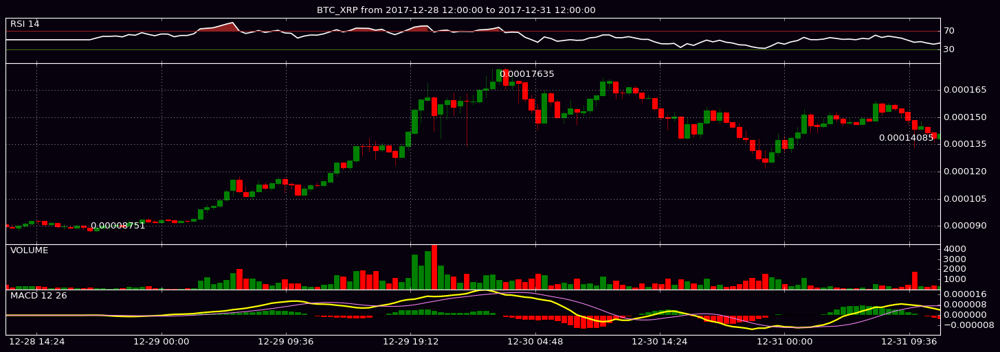
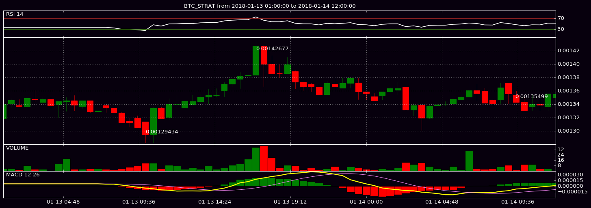
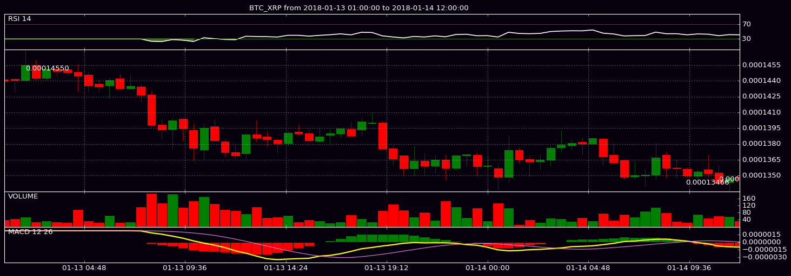
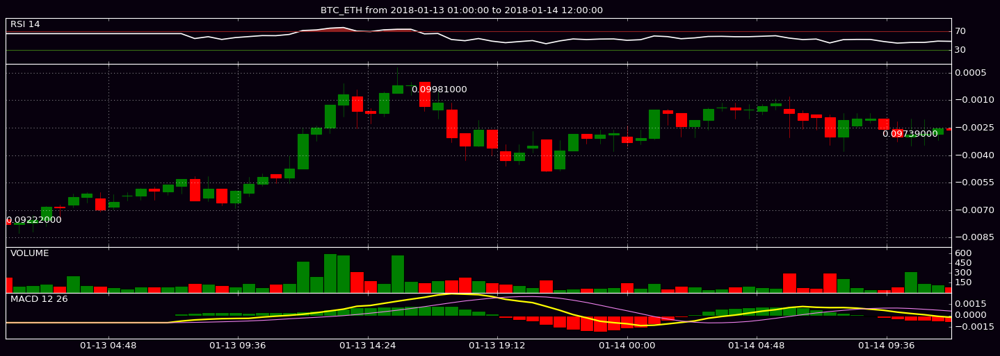
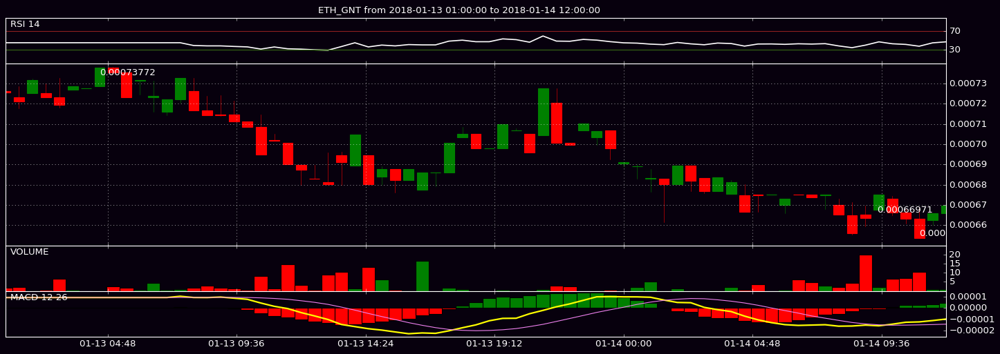

# PyPlot Polo Plotter

An altcoin charting module using the Poloniex API I put together while following along to [sentdex's](https://www.youtube.com/user/sentdex) very helpful [Advanced Matplotlib Series](https://pythonprogramming.net/advanced-matplotlib-graphing-charting-tutorial/).

1. Clone or download the now-deprecated [mpl_finance](https://github.com/matplotlib/mpl_finance) module.
2. Save `mpl_finance.py` to this repo's directory. 
3. (Or, to wherever your installation of Python sources packages from -- you just need to be able to "import" it.)
4. Get your `POLO_SECRET` and `POLO_KEY` from your [Poloniex](https://m.poloniex.com/support/api/) account API.
5. Input both of the above into `source.sh` and export as environment variables from your console (`$ source source.sh`).
6. Import the module (in Python script or REPL):


```python
import poloplotter as poloplt
```

The `plot_coin()` method follows the same structure as the [Poloniex API](https://m.poloniex.com/support/api/)'s `returnChartData` method, accepting a currency pair, candlestick period (300, 900, 1800, 7200, 14400, or 86400), start and end. 

Use the `%Y-%m-%d %H:%M:%S` format for the starting and ending datetimes. (These will be converted to Unix timestamps per the Poloniex API's requirements.)

### Plot a Single Coin


```python
poloplt.plot_coin('BTC_XRP',1800,'2017-12-28 12:00:00','2017-12-31 12:00:00')
```





### Plot Multiple Coins


```python
list_of_coins = [
    'BTC_STRAT',
    'BTC_XRP',
    'BTC_ETH',
    'ETH_GNT',
]

for coin in list_of_coins:
    poloplt.plot_coin(coin,1800,'2018-01-13 01:00:00','2018-01-14 12:00:00')
```













